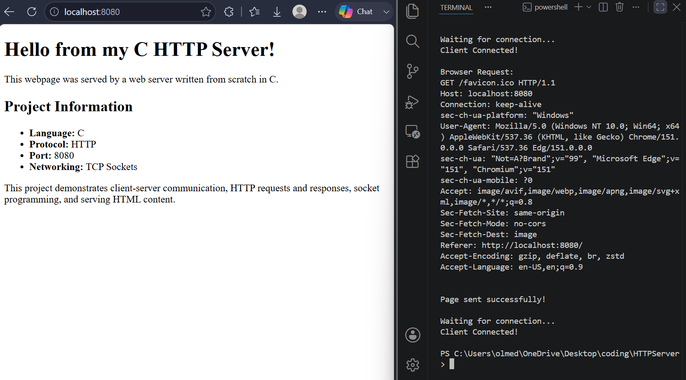

# 🌐 HTTP Web Server in C

A lightweight HTTP web server built from scratch in C using TCP socket programming.

This project demonstrates how a web browser communicates with a server through HTTP and how a C program can receive browser requests and serve HTML content.

## 📸 Demo




## 🚀 Features

* TCP socket creation
* Server binding and listening
* Client connection handling
* HTTP request reception
* HTTP response generation
* HTML file serving
* 404 Not Found response
* Cross-platform socket handling for Windows and Linux

## 🛠️ Technologies

* **C**
* **TCP/IP**
* **HTTP**
* **Socket Programming**
* **GCC**
* **Git/GitHub**

## ⚙️ How It Works

The server follows a basic client-server workflow:

```text
Browser
   │
   │ HTTP Request
   ▼
C HTTP Server
   │
   │ Reads index.html
   ▼
HTTP Response
   │
   ▼
Browser displays webpage
```

The server:

1. Creates a TCP socket.
2. Binds the socket to port `8080`.
3. Listens for incoming connections.
4. Accepts a client connection.
5. Receives the browser's HTTP request.
6. Opens `index.html`.
7. Creates an HTTP `200 OK` response.
8. Sends the HTML content back to the browser.
9. Returns a `404 Not Found` response if `index.html` cannot be found.
10. Closes the client connection and waits for another request.

## 💻 Running the Server

### 1. Clone the repository

```bash
git clone https://github.com/YOUR-USERNAME/http-server.git
cd http-server
```

### 2. Compile

On Windows using GCC:

```bash
gcc server.c -o server -lws2_32
```

### 3. Run

```powershell
.\server.exe
```

You should see:

```text
=================================
       C HTTP SERVER STARTED
=================================
Listening on port 8080
Open your browser:
http://localhost:8080

Waiting for connection...
```

### 4. Open the server

Open a browser and navigate to:

```text
http://localhost:8080
```

The server will return the contents of `index.html`.

## 📂 Project Structure

```text
http-server/
├── server.c       # HTTP server implementation
├── index.html     # Webpage served by the server
├── .gitignore     # Prevents compiled files from being uploaded
└── README.md      # Project documentation
```

## 📚 What I Learned

Through this project, I practiced:

* TCP socket programming
* Client-server architecture
* HTTP request and response structure
* Network communication
* File handling in C
* Buffer management
* Error handling
* Cross-platform programming
* Compiling and debugging C programs
* Using Git and GitHub for version control

## 🔨 Future Improvements

Some improvements I plan to explore include:

* Supporting multiple simultaneous clients
* Improving HTTP request parsing
* Supporting additional HTTP methods
* Serving different files based on requested URLs
* Adding MIME type detection
* Improving error handling
* Adding multithreading

## 👨‍💻 Author

**Daniel Olmedo**

Computer Science Student | Aspiring Software Engineer
